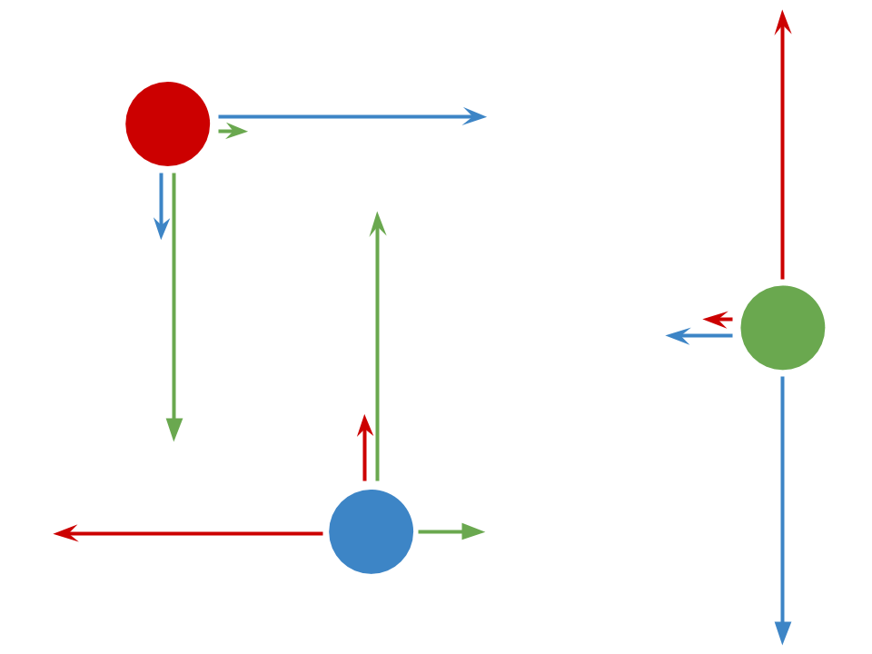

This is a 2 dimensional simulator of the forces of gravity.

### Getting Started

```
$ git clone https://github.com/zzggbb/gravity
$ cd gravity
$ python3 -m virtualenv .
$ source bin/activate
$ pip install -r requirements.txt
```

To run the simulation:
```
$ python3 gravity.py
```

To leave the virtual env:
```
$ deactivate
```

### Features
* play/pause the simulation
* seek forwards/backwards in time
* add/remove objects
* change the properties of an object
  * color
  * mass
  * density
  * radius
  * position
  * velocity
  * acceleration

* change the type of collision undergone by objects
  * perfectly elastic (objects bounce)
  * perfectly inelastic (objects stick)
  * no collision

* toggle the display of velocity and acceleration
vectors

### Controls
| key | action |
| - | - |
|space | toggle play/pause |
|a | add object |
|b | seek backwards |
|c | toggle collision type |
|d | toggle acceleration and velocity vectors |
|e | edit object properties |
|f | seek forwards |
|x | remove object |
