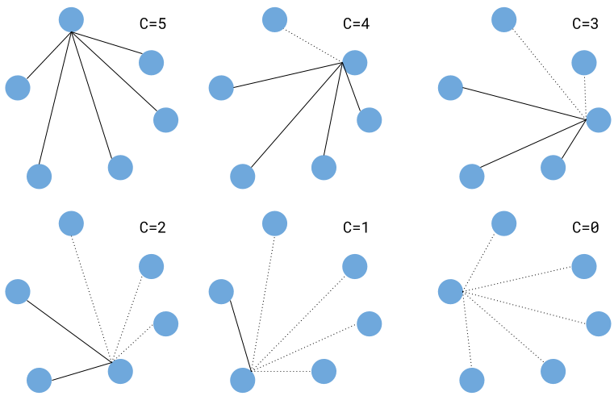

This is a 2 dimensional simulator of the forces of gravity.

### Getting Started

```
$ git clone https://github.com/zzggbb/gravity
$ cd gravity
$ python3 -m virtualenv .
$ source bin/activate
$ pip install -r requirements.txt
```

To run the simulation:
```
$ python3 main.py
```

To leave the virtual env:
```
$ deactivate
```

### Features
* play/pause the simulation
* seek forwards/backwards in time
* add/remove objects
* change the properties of an object
  * color
  * mass
  * density
  * radius
  * position
  * velocity
  * acceleration

* change the type of collision undergone by objects
  * perfectly elastic (objects bounce)
  * perfectly inelastic (objects stick)
  * no collision

* toggle the display of velocity and acceleration
vectors

### Controls
| key | action |
| - | - |
|space | toggle play/pause |
|a | toggle display of acceleration vector |
|b | seek backwards |
|c | toggle collision type |
|e | edit object properties |
|f | seek forwards |
|n | new object at mouse position |
|q | quit the simulation |
|v | toggle display of velocity vector |
|x | remove object at mouse position |

### Acceleration Calculation
For each frame, the simulation must calculate the acceleration
caused by the force of gravity between each mass.

Here is one approach to this problem:
```python
for body in bodies:
    sum = Vector(0,0)
    for other in bodies:
        if other == body:
            continue

        diff = other.position - body.position
        dist_3 = (diff.x**2 + diff.y**2)**(3.0/2.0)
        sum += (other.mass / dist_3) * diff

    body.acceleration = GRAVITATION * sum
```

However, this approach does twice as many calculations as
necessary. The force on an object A due to another
object B is equal in magnitude and opposite in direction to the
force on B due to A. Therefore we could cache each calculation
and check this cache before performing any calculation. This
avoids unnecessary calculations, but we are still stuck with the
runtime of `n^2`.

Another approach to this problem comes from the observation
that after doing `n` calculations for a body, we can do `n-1`
calculations for the next body. Here's a diagram:



This approach has a runtime of `n(n-1)/2`.
